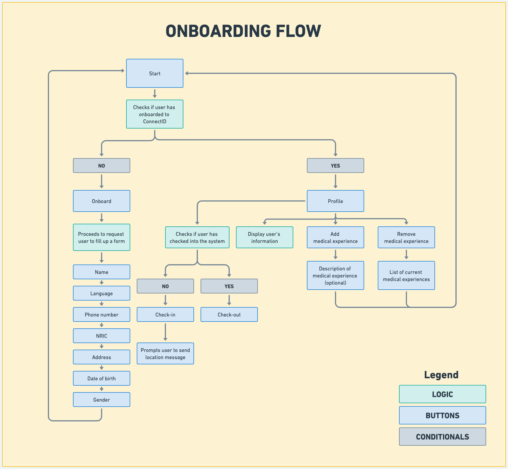
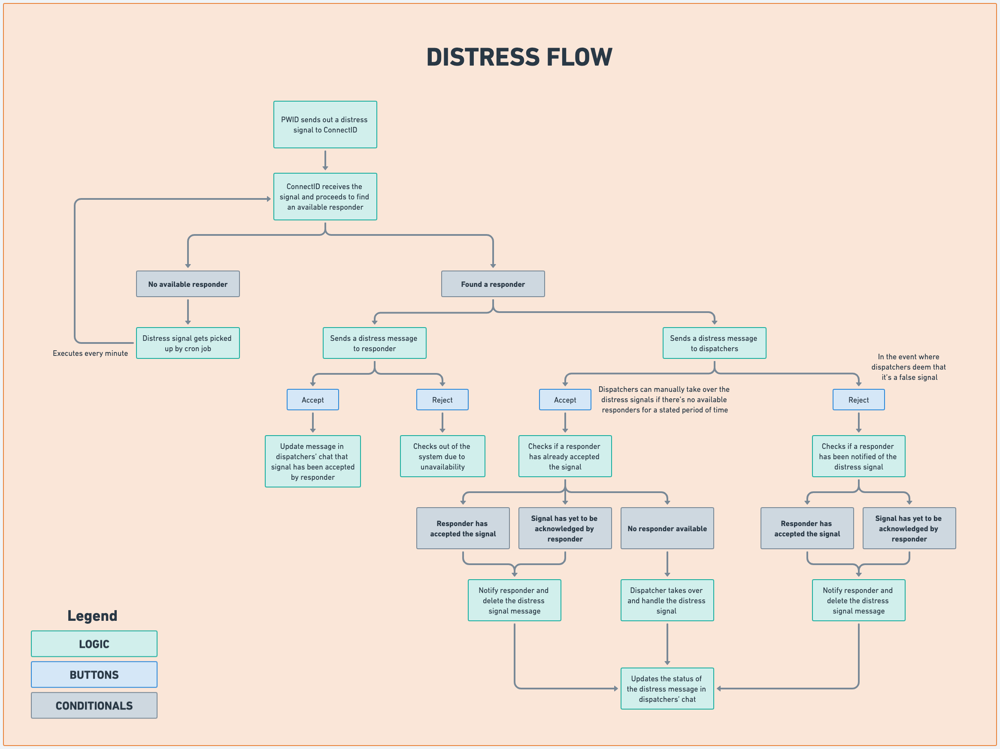
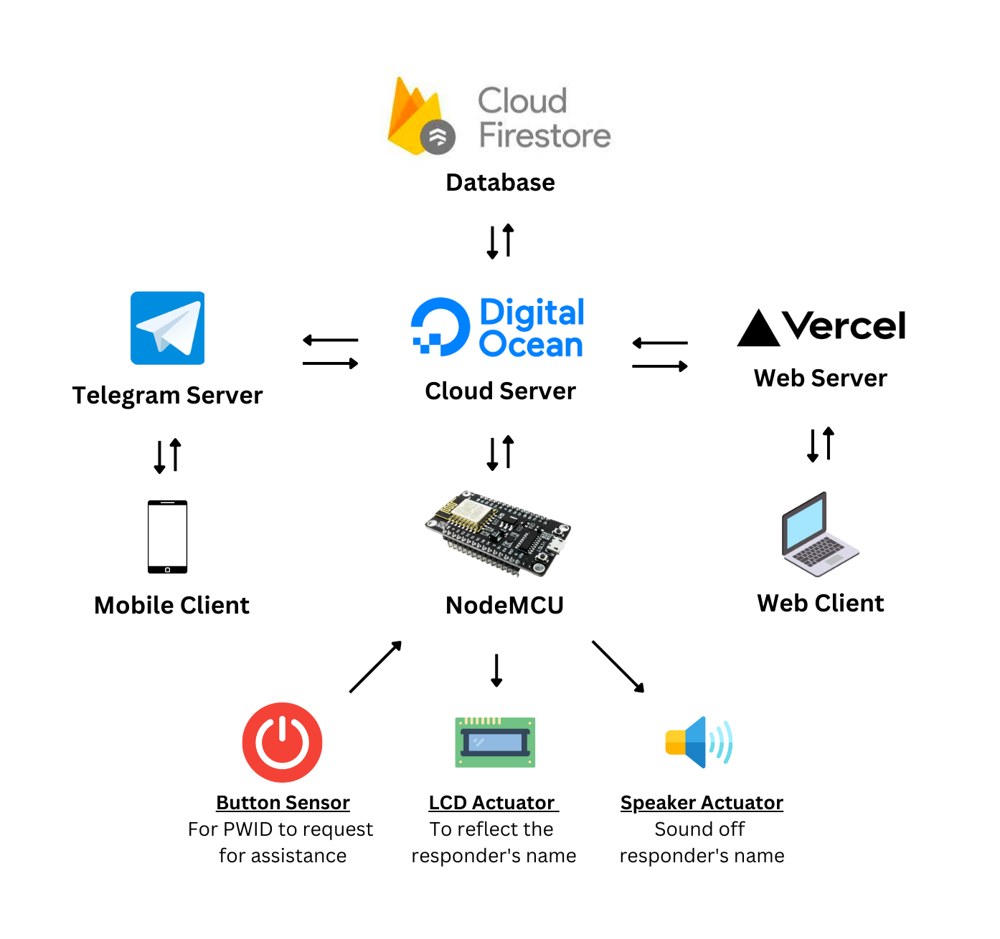

# ConnectID

## Problem Statement

Persons with Intellectual Disabilities (PWIDs) are often given lanyards with their personal information so that others can help them in emergencies or if they are lost. It contains basic information about the person which is often inadequate for members of the public to support them effectively. There is a need to ideate a solution by leveraging technology to improve the PWID’s identification, so that it can include more information about them (*i.e. communication preferences, emergency contacts and how others could support him/her*)

## Stakeholders

During the ideation of the solution, the requirements of the following stakeholders were being taken into consideration:

- **PWIDS** are defined as Persons with Intellectual Disabilities who are the end users of the hardware device
- **Responders** are defined as public volunteers who offers help to the PWIDs, should they be in the vicinity when the SOS signal was emitted
- **Dispatchers** are defined as [MINDS](https://www.minds.org.sg/) personnel who will be monitoring the situation and liaising with the respective stakeholders

## Core Features

| Feature                   | Description                                                                                                                                                                                                                                                                                                                                                             |
| :------------------------ | :---------------------------------------------------------------------------------------------------------------------------------------------------------------------------------------------------------------------------------------------------------------------------------------------------------------------------------------------------------------------- |
| Telegram (**Responders**) | Acts as a platform to onboard responders, whereby they are able to receive SOS signals if they are in the vicinity                                                                                                                                                                                                                                                      |
| Telegram (**Dispatcher**) | Acts as a platform for dispatchers to monitor the situation via their phones if they not have access to the web dashboard                                                                                                                                                                                                                                               |
| Web                       | Acts as a dashboard for [MINDS](https://www.minds.org.sg/) personnel to monitor the situation on the ground via a Map view                                                                                                                                                                                                                                              |
| SOS Signal                | Emits a SOS signal whereby a nearest responder will be notified. If there's no available responder, dispatchers are able to handle the situation manually. Geocoordinates are obtained via either the [hardware device's GPS coordinates](https://lastminuteengineers.com/neo6m-gps-arduino-tutorial/) or based off the [location of the request](https://ip-api.com/). |
| Matching of Responders    | Matching of responders to PWIDs are based on the following: <ul><li>PWID's gender preference</i><li>PWID's language preference</i><li>Nearest location based off coordinates (*i.e. latitude, longitude*)</i><li>Responder's medical experiences</i></ul>                                                                                                               |
| Cron Job                  | Searches for pending SOS signals that have yet to be acknowledged and attempts to link the nearest responder                                                                                                                                                                                                                                                            |

## Flow Diagrams





## Architecture Diagram



## Local Deployment

### Frontend

```bash
cd frontend
yarn install
yarn dev
```

#### Environment Variables

| Name       | Description                 |
| ---------- | --------------------------- |
| `DEV_URL`  | Development URL for backend |
| `PROD_URL` | Production URL for backend  |

### Backend

```bash
cd backend

python3 -m venv .
source venv/bin/activate

pip install -r requirements.txt

chmod +x dev.sh
./dev.sh
```

#### Environment Variables

| Name                                    | Description                                                                                 |
| --------------------------------------- | ------------------------------------------------------------------------------------------- |
| `FIRESTORE_TYPE`                        | Firestore credentials type                                                                  |
| `FIRESTORE_PROJECT_ID`                  | Firestore project ID                                                                        |
| `FIRESTORE_PRIVATE_KEY_ID`              | Firestore private key ID                                                                    |
| `FIRESTORE_PRIVATE_KEY`                 | Firestore private key                                                                       |
| `FIRESTORE_CLIENT_EMAIL`                | Firestore client email                                                                      |
| `FIRESTORE_CLIENT_ID`                   | Firestore client ID                                                                         |
| `FIRESTORE_AUTH_URI`                    | Firestore authentication URI                                                                |
| `FIRESTORE_TOKEN_URI`                   | Firestore token URI                                                                         |
| `FIRESTORE_AUTH_PROVIDER_X509_CERT_URL` | Firestore authentication certificate                                                        |
| `TELEGRAM_API_TOKEN`                    | Telegram bot token from [BotFather](https://core.telegram.org/bots#3-how-do-i-create-a-bot) |
| `TELEGRAM_CHAT_ID`                      | Telegram chat ID for dispatchers' group chat                                                |
| `PROD_WEBHOOK_URL`                      | Production URL for Telegram webhook                                                         |
